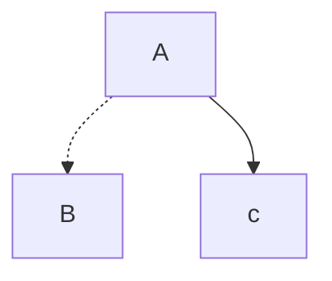

## 정적 사이트 생성기의 종류

각 정적 사이트 생성기는 특정 용도와 요구사항에 따라 선택할 수 있습니다. 
예를 들어, Gatsby는 대규모 데이터 소스를 사용하는 프로젝트에 적합하며, Hugo는 빠른 빌드 속도가 중요한 프로젝트에, Astro는 최신 웹 기술과 성능 최적화를 원하는 프로젝트에 적합합니다. Jekyll은 GitHub Pages와의 통합이 중요한 경우에, Docusaurus는 기술 문서화 작업에, MkDocs는 간단한 문서 사이트에 적합합니다.
### Docusaurus
- 특징 : React 기반의 정적 사이트 생성기로, 문서화와 블로그 기능을 통합적으로 제공.
- 장점 : 빠른 시작과 설정, **[강력한 문서화 기능](Intro.md)**, SEO 최적화, 다양한 플러그인 지원.
- 단점 : React에 대한 기본적인 이해가 필요하며, 복잡한 커스터마이징이 어려울 수 있음.
### Hugo
- 특징 : Go 언어로 작성된 매우 빠른 정적 사이트 생성기.
- 장점 : 매우 빠른 빌드 속도와 다국어 지원.
- 단점 : 템플릿 언어가 다소 복잡할 수 있음.
### Jekyll
- 특징 : Ruby 기반의 정적 사이트 생성기로, GitHub Pages와 잘 통합됨.
- 장점 : 설정이 간단하고 GitHub Pages에 무료로 호스팅 가능.
- 단점 : 대규모 사이트에서 빌드 시간이 길어질 수 있음.
### Gatsby
- 특징 : React를 기반으로 한 정적 사이트 생성기로, GraphQL을 사용하여 데이터를 관리.
- 장점 : 동적 기능을 쉽게 추가할 수 있고, 다양한 플러그인 제공.
- 단점 : 초기 설정이 복잡할 수 있으며, 빌드 시간이 길어질 수 있음.
### Next.js (정적 사이트 생성 모드)
- 특징 : React 기반의 프레임워크로, 정적 사이트 생성(SSG) 및 서버 사이드 렌더링(SSR)을 모두 지원.
- 장점 : 동적 콘텐츠와 정적 콘텐츠를 모두 쉽게 관리 가능.
- 단점 : 복잡한 설정과 학습 곡선이 있을 수 있음.
### Eleventy
- 특징 : 단순성과 유연성을 중시한 정적 사이트 생성기.
- 장점 : 설정이 유연하고 다양한 템플릿 엔진을 지원.
- 단점 : 일부 고급 기능이 부족할 수 있음.
### Astro
- 특징: JavaScript와 프레임워크 무관성을 강조하는 새로운 정적 사이트 생성기.
- 장점: 다양한 프레임워크(React, Vue, Svelte 등)를 함께 사용할 수 있으며, 성능 최적화에 강점이 있음.
- 단점: 상대적으로 새로운 도구이기 때문에 커뮤니티와 자료가 다른 도구들에 비해 부족할 수 있음.
### Hexo
- 특징: Node.js 기반의 빠르고 간단한 정적 사이트 생성기.
- 장점: 설정이 간단하고 다양한 플러그인 및 테마를 지원.
- 단점: 대규모 사이트에서 빌드 시간이 길어질 수 있음.
### VuePress
- 특징: Vue.js 기반의 정적 사이트 생성기.
- 장점: Vue.js를 사용한 쉽고 직관적인 설정, Vue 생태계와의 호환성.
- 단점: Vue.js에 대한 기본적인 이해가 필요함.
### Metalsmith
- 특징: 매우 유연하고 플러그인 기반의 정적 사이트 생성기.
- 장점: 플러그인을 통해 거의 모든 것을 커스터마이즈 가능.
- 단점: 설정이 복잡할 수 있으며, 기본 기능이 제한적임.
### Gridsome
- 특징: Vue.js를 기반으로 한 정적 사이트 생성기로, GraphQL을 사용하여 데이터를 관리.
- 장점: 동적 기능을 쉽게 추가할 수 있고, 다양한 플러그인 제공.
- 단점: 초기 설정이 복잡할 수 있으며, Vue.js에 대한 기본적인 이해가 필요함.

